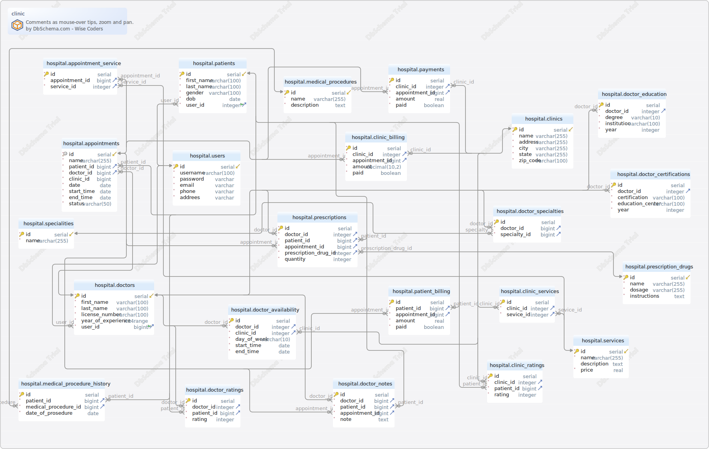

#clinic
Generated using [DbSchema](https://dbschema.com)

### clinic

### Table hospital.appointment_service 
| | | |
|---|---|---|
| * &#128273;  | id| serial  |
| * &#11016; | appointment\_id| bigint  |
| * &#11016; | service\_id| integer  |

##### Indexes 
| | | |
|---|---|---|
| &#128273;  | pk\_appointment\_servi | ON id|

##### Foreign Keys
| | | |
|---|---|---|
|  | fk_appointment_ | ( appointment\_id ) ref [hospital.appointments](#appointments) (id) |
|  | fk_appointment_services | ( service\_id ) ref [hospital.services](#services) (id) |

### Table hospital.appointments 
| | | |
|---|---|---|
| * &#128269; &#11019; | id| serial  |
| * | name| varchar(255)  |
| * &#11016; | patient\_id| bigint  |
| * &#11016; | doctor\_id| bigint  |
| * | clinic\_id| bigint  |
| * | date| date  |
| * | start\_time| date  |
| * | end\_time| date  |
| * | status| varchar(50)  |

##### Indexes 
| | | |
|---|---|---|
| &#128269;  | unq\_appointments\_id | ON id|

##### Foreign Keys
| | | |
|---|---|---|
|  | fk_appointments_patients | ( patient\_id ) ref [hospital.patients](#patients) (id) |
|  | fk_appointments_doctors | ( doctor\_id ) ref [hospital.doctors](#doctors) (id) |

### Table hospital.clinic_billing 
| | | |
|---|---|---|
| * &#128273;  | id| serial  |
| * &#11016; | clinic\_id| integer  |
| * &#11016; | appointment\_id| bigint  |
| * | amount| decimal(10,2)  |
| * | paid| boolean  DEFAULT false |

##### Indexes 
| | | |
|---|---|---|
| &#128273;  | pk\_clinic\_billing | ON id|

##### Foreign Keys
| | | |
|---|---|---|
|  | fk_clinic_billing_clinics | ( clinic\_id ) ref [hospital.clinics](#clinics) (id) |
|  | fk_clinic_billing_appointments | ( appointment\_id ) ref [hospital.appointments](#appointments) (id) |

### Table hospital.clinic_ratings 
| | | |
|---|---|---|
| * &#128273;  | id| serial  |
| * &#11016; | clinic\_id| integer  |
| * &#11016; | patient\_id| bigint  |
| * | rating| integer  |

##### Indexes 
| | | |
|---|---|---|
| &#128273;  | pk\_clinic\_ratings | ON id|

##### Foreign Keys
| | | |
|---|---|---|
|  | fk_clinic_ratings_clinics | ( clinic\_id ) ref [hospital.clinics](#clinics) (id) |
|  | fk_clinic_ratings_patients | ( patient\_id ) ref [hospital.patients](#patients) (id) |

### Table hospital.clinic_services 
| | | |
|---|---|---|
| * &#128273;  | id| serial  |
| * &#11016; | clinic\_id| integer  |
| * &#11016; | sevice\_id| integer  |

##### Indexes 
| | | |
|---|---|---|
| &#128273;  | pk\_clinic\_services | ON id|

##### Foreign Keys
| | | |
|---|---|---|
|  | fk_clinic_services_clinics | ( clinic\_id ) ref [hospital.clinics](#clinics) (id) |
|  | fk_clinic_services_services | ( sevice\_id ) ref [hospital.services](#services) (id) |

### Table hospital.clinics 
| | | |
|---|---|---|
| * &#128273;  &#11019; | id| serial  |
| * | name| varchar(255)  |
| * | address| varchar(255)  |
| * | city| varchar(255)  |
| * | state| varchar(255)  |
| * | zip\_code| varchar(100)  |

##### Indexes 
| | | |
|---|---|---|
| &#128273;  | pk\_clinics | ON id|

### Table hospital.doctor_availability 
| | | |
|---|---|---|
| * &#128273;  | id| serial  |
| * &#11016; | doctor\_id| integer  |
| * &#11016; | clinic\_id| integer  |
| * | day\_of\_week| varchar(10)  |
| * | start\_time| date  |
| * | end\_time| date  |

##### Indexes 
| | | |
|---|---|---|
| &#128273;  | pk\_doctor\_availability | ON id|

##### Foreign Keys
| | | |
|---|---|---|
|  | fk_doctor_availability_doctors | ( doctor\_id ) ref [hospital.doctors](#doctors) (id) |
|  | fk_doctor_availability_clinics | ( clinic\_id ) ref [hospital.clinics](#clinics) (id) |

### Table hospital.doctor_certifications 
| | | |
|---|---|---|
| * &#128273;  | id| serial  |
| * &#11016; | doctor\_id| integer  |
| * | certification| varchar(100)  |
| * | education\_center| varchar(100)  |
| * | year| integer  |

##### Indexes 
| | | |
|---|---|---|
| &#128273;  | pk\_doctor\_certifications | ON id|

##### Foreign Keys
| | | |
|---|---|---|
|  | fk_doctor_certifications | ( doctor\_id ) ref [hospital.doctors](#doctors) (id) |

### Table hospital.doctor_education 
| | | |
|---|---|---|
| * &#128273;  | id| serial  |
| * &#11016; | doctor\_id| integer  |
| * | degree| varchar(10)  |
| * | institution| varchar(100)  |
| * | year| integer  |

##### Indexes 
| | | |
|---|---|---|
| &#128273;  | pk\_doctor\_education | ON id|

##### Foreign Keys
| | | |
|---|---|---|
|  | fk_doctor_education_doctors | ( doctor\_id ) ref [hospital.doctors](#doctors) (id) |

### Table hospital.doctor_notes 
| | | |
|---|---|---|
| * &#128273;  | id| serial  |
| * &#11016; | doctor\_id| bigint  |
| * &#11016; | patient\_id| bigint  |
| * &#11016; | appointment\_id| bigint  |
| * | note| text  |

##### Indexes 
| | | |
|---|---|---|
| &#128273;  | pk\_doctor\_notes | ON id|

##### Foreign Keys
| | | |
|---|---|---|
|  | fk_doctor_notes_doctors | ( doctor\_id ) ref [hospital.doctors](#doctors) (id) |
|  | fk_doctor_notes_patients | ( patient\_id ) ref [hospital.patients](#patients) (id) |
|  | fk_doctor_notes_appointments | ( appointment\_id ) ref [hospital.appointments](#appointments) (id) |

### Table hospital.doctor_ratings 
| | | |
|---|---|---|
| * &#128273;  | id| serial  |
| * &#11016; | doctor\_id| integer  |
| * &#11016; | patient\_id| bigint  |
| * | rating| integer  |

##### Indexes 
| | | |
|---|---|---|
| &#128273;  | pk\_doctor\_ratings | ON id|

##### Foreign Keys
| | | |
|---|---|---|
|  | fk_doctor_ratings_doctors | ( doctor\_id ) ref [hospital.doctors](#doctors) (id) |
|  | fk_doctor_ratings_patients | ( patient\_id ) ref [hospital.patients](#patients) (id) |

### Table hospital.doctor_specialties 
| | | |
|---|---|---|
| * &#128273;  | id| serial  |
| * &#11016; | doctor\_id| bigint  |
| * &#11016; | specialty\_id| bigint  |

##### Indexes 
| | | |
|---|---|---|
| &#128273;  | pk\_doctor\_specialties | ON id|

##### Foreign Keys
| | | |
|---|---|---|
|  | fk_doctor_specialties_doctors | ( doctor\_id ) ref [hospital.doctors](#doctors) (id) |
|  | fk_doctor_specialties | ( specialty\_id ) ref [hospital.specialities](#specialities) (id) |

### Table hospital.doctors 
| | | |
|---|---|---|
| * &#128273;  &#11019; | id| serial  |
| * | first\_name| varchar(100)  |
| * | last\_name| varchar(100)  |
| * | license\_number| varchar(100)  |
| * | year\_of\_experience| int4range  |
| * &#11016; | user\_id| bigint  |

##### Indexes 
| | | |
|---|---|---|
| &#128273;  | pk\_doctors | ON id|

##### Foreign Keys
| | | |
|---|---|---|
|  | fk_doctors_users | ( user\_id ) ref [hospital.users](#users) (id) |

### Table hospital.medical_procedure_history 
| | | |
|---|---|---|
| * &#128273;  | id| serial  |
| * &#11016; | patient\_id| bigint  |
| * &#11016; | medical\_procedure\_id| bigint  |
| * | date\_of\_prosedure| date  |

##### Indexes 
| | | |
|---|---|---|
| &#128273;  | pk\_medical\_procedure\_history | ON id|

##### Foreign Keys
| | | |
|---|---|---|
|  | fk_medical_procedure_history | ( patient\_id ) ref [hospital.patients](#patients) (id) |
|  | fk_medical_procedure | ( medical\_procedure\_id ) ref [hospital.medical\_procedures](#medical\_procedures) (id) |

### Table hospital.medical_procedures 
| | | |
|---|---|---|
| * &#128273;  &#11019; | id| serial  |
| * | name| varchar(255)  |
| * | description| text  |

##### Indexes 
| | | |
|---|---|---|
| &#128273;  | pk\_medical\_procedures | ON id|

### Table hospital.patient_billing 
| | | |
|---|---|---|
| * &#128273;  | id| serial  |
| * &#11016; | patient\_id| bigint  |
| * &#11016; | appointment\_id| bigint  |
| * | amount| real  |
| * | paid| boolean  DEFAULT false |

##### Indexes 
| | | |
|---|---|---|
| &#128273;  | pk\_patient\_billing | ON id|

##### Foreign Keys
| | | |
|---|---|---|
|  | fk_patient_billing_patients | ( patient\_id ) ref [hospital.patients](#patients) (id) |
|  | fk_patient_billing | ( appointment\_id ) ref [hospital.appointments](#appointments) (id) |

### Table hospital.patients 
| | | |
|---|---|---|
| * &#128273;  &#11019; | id| serial  |
| * | first\_name| varchar(100)  |
| * | last\_name| varchar(100)  |
| * | gender| varchar(100)  |
| * | dob| date  |
| * &#11016; | user\_id| integer  |

##### Indexes 
| | | |
|---|---|---|
| &#128273;  | pk\_patients | ON id|

##### Foreign Keys
| | | |
|---|---|---|
|  | fk_patients_users | ( user\_id ) ref [hospital.users](#users) (id) |

### Table hospital.payments 
| | | |
|---|---|---|
| * &#128273;  | id| serial  |
| * &#11016; | clinic\_id| integer  |
| * &#11016; | appointment\_id| bigint  |
| * | amount| real  |
| * | paid| boolean  DEFAULT false |

##### Indexes 
| | | |
|---|---|---|
| &#128273;  | pk\_payments | ON id|

##### Foreign Keys
| | | |
|---|---|---|
|  | fk_payments_clinics | ( clinic\_id ) ref [hospital.clinics](#clinics) (id) |
|  | fk_payments_appointments | ( appointment\_id ) ref [hospital.appointments](#appointments) (id) |

### Table hospital.prescription_drugs 
| | | |
|---|---|---|
| * &#128273;  &#11019; | id| serial  |
| * | name| varchar(255)  |
| * | dosage| varchar(255)  |
| * | instructions| text  |

##### Indexes 
| | | |
|---|---|---|
| &#128273;  | pk\_prescription\_drugs | ON id|

### Table hospital.prescriptions 
| | | |
|---|---|---|
| * &#128273;  | id| serial  |
| * &#11016; | doctor\_id| integer  |
| * &#11016; | patient\_id| bigint  |
| * &#11016; | appointment\_id| bigint  |
| * &#11016; | prescription\_drug\_id| integer  |
| * | quantity| integer  |

##### Indexes 
| | | |
|---|---|---|
| &#128273;  | pk\_prescriptions | ON id|

##### Foreign Keys
| | | |
|---|---|---|
|  | fk_prescriptions_doctors | ( doctor\_id ) ref [hospital.doctors](#doctors) (id) |
|  | fk_prescriptions_patients | ( patient\_id ) ref [hospital.patients](#patients) (id) |
|  | fk_prescriptions_appointments | ( appointment\_id ) ref [hospital.appointments](#appointments) (id) |
|  | fk_prescriptions | ( prescription\_drug\_id ) ref [hospital.prescription\_drugs](#prescription\_drugs) (id) |

### Table hospital.services 
| | | |
|---|---|---|
| * &#128273;  &#11019; | id| serial  |
| * | name| varchar(255)  |
|  | description| text  |
| * | price| real  |

##### Indexes 
| | | |
|---|---|---|
| &#128273;  | pk\_services | ON id|

### Table hospital.specialities 
| | | |
|---|---|---|
| * &#128273;  &#11019; | id| serial  |
| * | name| varchar(255)  |

##### Indexes 
| | | |
|---|---|---|
| &#128273;  | pk\_specialities | ON id|

### Table hospital.users 
| | | |
|---|---|---|
| * &#128273;  &#11019; | id| serial  |
| * | username| varchar(100)  |
| * | password| varchar  |
| * | email| varchar  |
| * | phone| varchar  |
| * | addrees| varchar  |

##### Indexes 
| | | |
|---|---|---|
| &#128273;  | pk\_ users | ON id|

